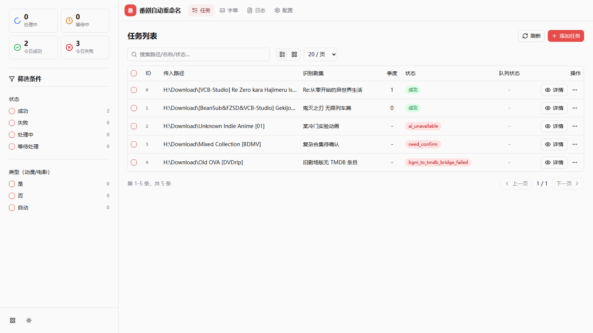
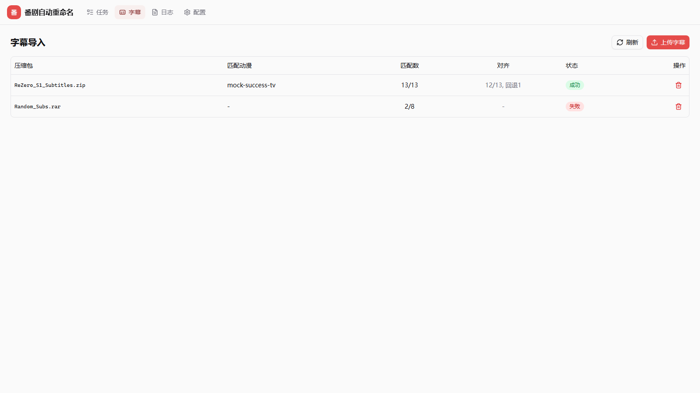
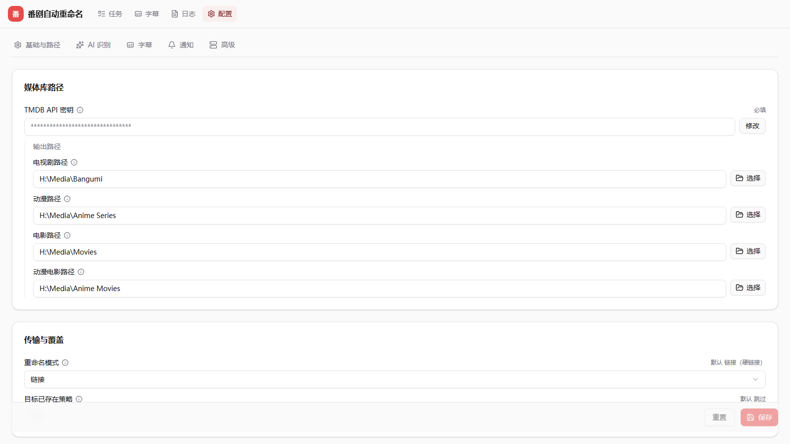

## 简介

Bangumi Auto Rename 是一条 **AI-first + strict** 的媒体整理流水线，而不是单纯的「重命名器」。

它把一个本地下载包，串联成一条完整的整理链路：

> **任务队列 → Case Agent 语义映射 → BGM→TMDB 桥接 → 字幕导入 / 自动抓取 → Emby 刷新 → Telegram 通知**

最终把本地文件整理为 Emby 可精准刮削的目录结构。语义推理由 **Pi Case Agent**（Node.js sidecar）承担，固定层只做事实抽取与合同校验。

> [!IMPORTANT]
> 本项目面向自部署 / 进阶用户。运行需要同时具备 **Python、Node.js、Git** 三套环境，以及可用的 **AI 凭据**、**TMDB API** 与 **Bangumi** 网络。这不是「开箱即用」的轻量工具——它是一条带严格合同校验的重型语义流水线。

> 本仓库为基于原项目 [KimigaiiWuyi/Bangumi_Auto_Rename](https://github.com/KimigaiiWuyi/Bangumi_Auto_Rename) 的二改版本，独立维护，已全面重构为 AI-first 流水线架构。

## 回归基线：full146

项目维护一个 **146 个真实下载包**的样本池（`tests/sample_pool/raw/`），对 Local→Bangumi→TMDB 全链路做 mapping-only 回归。当前基线：

> **段1 Local→Bangumi：146/146 accepted　·　段2 Bangumi→TMDB：146/146 accepted　·　联合 146/146 = 100% accepted**

覆盖空之境界（7 部剧场版合集）、ARIA 全系列 BD-Box、向阳素描（1559 文件 / 4 季 + OVA）、魔法少女小圆全系列、高达创战者、鬼灭多季、Love Death & Robots 等复杂类型。完整 per-sample 结果与复现方式见 [full146 回归报告](docs/FULL146_REGRESSION_REPORT.md)。

## 它解决什么问题

下载来的番剧资源，目录结构往往与 Emby 的刮削口径不兼容。典型如一个合集里同时包含多季正片、剧场版、特别篇：

```text
├─[VCB-Studio] Re Zero kara Hajimeru Isekai Seikatsu
│  ├─[VCB-Studio] Re Zero kara Hajimeru Isekai Seikatsu 2nd Season [Ma10p_1080p]
│  ├─[VCB-Studio] Re Zero kara Hajimeru Isekai Seikatsu Hyouketsu no Kizuna [Ma10p_1080p]
│  ├─[VCB-Studio] Re Zero kara Hajimeru Isekai Seikatsu Memory Snow [Ma10p_1080p]
│  ├─[VCB-Studio] Re Zero kara Hajimeru Isekai Seikatsu [Ma10p_1080p]
```

这种集合里混杂着第一季、第二季、两部剧场版。本流水线会：

- 由 Case Agent 对包内文件做 evidence-driven 映射，判断每个文件属于哪一季 / 哪部剧场版 / 哪个特别篇；
- 经 BGM→TMDB 桥接生成 TMDB 目标路径（Season 0 / special 的合法落点由 TMDB legal_graph 决定，不是「先映射再过滤」）；
- 把番剧与电影分别、正确地以硬链接（默认）/复制/移动写入你指定的目录。

## 核心能力

当前已落地的四条主线：

- **Local→Bangumi→TMDB 全链路重命名**：本地包文件 → Case Agent evidence-driven 映射（Bangumi 标题/类型/季集）→ BGM→TMDB 桥接生成 TMDB 目标路径 → 迁移落盘。重复/越界由两个 Verifier 合同校验。
- **字幕导入**：字幕文件或压缩包 → 解压 → Case Agent 字幕→视频配对 → 落盘到目标目录，可选 `ffsubsync` 时间轴对齐。普通重命名任务中的关联字幕会按「复制」方式跟随视频迁移。
- **字幕自动抓取**：扫描落地后缺字幕的视频 → Case Agent 选帖/选包（acgrip 站点）→ 下载 → 配对落盘。支持**多季覆盖**（一帖可覆盖多 subject，多季番一次补齐）。
- **批次收尾通知**：批次结束后统一触发 **Emby 刷新** + **Telegram 汇总通知**（可配置成功/失败触发）。

## 技术架构

| 层 | 技术 |
|---|---|
| 语义推理 | **Pi Case Agent** — Node.js sidecar（`@earendil-works/pi-coding-agent`），4 套 case agent 各带合同 skill（`.pi/skills/`） |
| 后端 | Python + **FastAPI**（单端口 5999）：`/api/*` + `/sendTask` webhook + 队列调度 |
| 前端 | **Next.js 16 + React 19 + shadcn/ui + zustand**，`output:export` 静态导出，由 FastAPI 同端口托管 |
| 校验哲学 | **AI-first + strict**：固定层只做事实抽取与合同校验（coverage / duplicate / 越界 / 合法节点），不确定判断交 Case Agent；`fail_closed` 是合格业务结果，`invalid` 才是实现错误 |

四套 Pi Case Agent 与各自的合同 skill：

| Case Agent | 用途 | 合同 skill |
|---|---|---|
| Local→Bangumi | 本地包 → Bangumi subject/episode 映射 | `local-bangumi-organize` |
| BGM→TMDB 桥接 | Bangumi 映射 → TMDB 合法季集路径 | `tmdb-bridge-contract` |
| 字幕导入 | 字幕 → 落地视频配对 | `subtitle-mapping-contract` |
| 字幕自动抓取 | 选帖 / 选包（candidate ranking） | `auto-fetch-contract` |

> 旧的 Python 端 AI 映射链路（ai_processor）已移除，全链路走 Pi Case Agent + BGM→TMDB 桥接。OpenAI 兼容 API 在生产链路下仅作门禁/测试器，Pi 不可用时作为 fallback。

## 界面预览

前端为 **Next.js 16 + React 19 + shadcn/ui + zustand**，静态导出后由 FastAPI 同端口托管。以下截图使用示例数据生成，仅展示界面布局，不代表真实任务/配置。







> 实际界面以 `http://127.0.0.1:5999` 为准。若不构建前端直接启动，访问页面会提示「前端未构建」，API 与 webhook 仍可用。

## 使用方法

### 零、准备 API 密钥

#### TMDB API 密钥
- 进入 [TMDB 官网](https://www.themoviedb.org/settings/api) 申请
- 复制你的 **API 密钥**，后续会用到

#### AI 凭据（Pi Case Agent）
- 本项目语义推理走 **Pi Case Agent**，其凭据优先级为：Pi 独立覆盖键 → `ai_*` 配置 → `.pi/agent/auth.json`。
- **OpenAI 兼容 API**：申请 OpenAI API 密钥，或使用兼容的国内 API 服务
  - 推荐模型：deepseek-reasoner（性价比高，效果好）
- 如不配置任何可用 AI 凭据，任务会按 `ai_unavailable` 失败（默认严格模式 `ai_force_strict=true`）

### 一、安装

> [!IMPORTANT]
> 本版本要求本机存在 **Python、Node.js、Git** 三套环境（Node.js 用于 Pi sidecar 与前端构建）。

#### 环境要求
- Python `>=3.10`
- Node.js（建议 18+，用于 Pi sidecar 依赖与前端构建）
- Git

#### 从源码安装

```shell
git clone https://github.com/kafuuchino-s/Bangumi_Auto_Rename.git -b web
cd Bangumi_Auto_Rename

# 1. Python 依赖
pip install -r requirements.txt

# 2. Node.js 依赖（Pi sidecar 运行时）
npm install

# 3. 构建前端（生成 frontend/out 静态导出）
cd frontend
npm install
npm run build
cd ..
```

- 启动
  - `python -m src.start`（默认端口 5999）

> 若不构建前端直接启动，访问页面会提示「前端未构建」，API 与 webhook 仍可用。

#### Docker

```shell
docker build -t bangumi-auto-rename .
docker run -p 5999:5999 bangumi-auto-rename
```

- 镜像已内置 `ffmpeg` / `unrar` 与配置页 AI 测试样例。
- 默认按非浏览器抓取构建；若启用 `subtitle_auto_fetch_browser_enabled=true`，需要额外构建带浏览器运行时的镜像。

### 二、配置与使用

- 打开网页之后（默认端口 5999，即地址为 `http://127.0.0.1:5999`）
- 先进入配置页，按 5 个场景分组配置：
  - **通用配置**：TMDB API 密钥、整理路径、传输模式、覆盖策略
  - **AI 配置**：OpenAI 兼容 API 密钥、Base URL、模型、接口（Pi 凭据 fallback）
  - **字幕配置**：字幕同步、字幕 Case Agent、自动抓取
  - **通知配置**：Emby 刷新、Telegram 汇总通知
  - **高级配置**：队列并发、Docker 路径映射、跳过标签、硬链降级等
- 点击添加任务即可使用

### 三、AI 主流程说明（Pi Case Agent）

> [!WARNING]
> 默认 `ai_force_strict=true`，AI 不可用或结果不满足合同时任务会失败，**不会自动回退到传统规则**。这是有意的设计，保证结果可解释、可审计。

#### 工作方式
- **Pi Case Agent** 采用 evidence-driven 多轮推理：主动发起 evidence request → 构建 MappingDraft → 经 Verifier 合同校验（coverage / duplicate / accounting / 合法节点存在性）。
- 判定为 `accepted` 的映射经 **BGM→TMDB 桥接** 生成 TMDB 目标路径并执行迁移落盘。
- Season 0 / special 的合法落点由 TMDB legal_graph 决定，不是「先映射再过滤」。

#### 结果四态语义
- `accepted`：合同通过，落盘
- `fail_closed`：合同不通过，**合格的失败**（不落盘部分匹配，对外映射 `need_confirm` 带 `case_agent_status` 审计）
- `need_confirm`：AI 不确定，待人工
- `invalid`：实现或合同错误

#### 可观测性
任务记录写入 `ai_attempted / ai_used / ai_confidence / failure_reason / pipeline_mode`。

#### 注意事项
- 需要 Node.js 环境运行 Pi sidecar，并有可用的 AI 凭据（`ai_*` 或 `.pi/agent/auth.json`）
- 默认严格模式下，AI 分析失败不会自动回退到传统规则
- 建议先用配置页的 API 测试功能验证凭据是否可用

### 四、字幕：导入与自动抓取

#### 字幕导入（ffsubsync 对齐）
- 支持直接导入字幕文件（如 `.ass/.srt/.ssa`）或字幕压缩包（如 `.zip/.rar`）
- 字幕 Case Agent 完成字幕→视频配对，可选 `ffsubsync` 自时间轴对齐（默认 `best_effort`）
- 普通重命名任务中的关联字幕会按「复制」方式写入目标目录（不受主传输模式影响）

配置入口（配置页 **字幕配置** Tab）：
- `subtitle_sync_enabled` / `subtitle_sync_mode`（`best_effort` / `strict`）/ `subtitle_sync_executable` / `subtitle_sync_extra_args` / `subtitle_sync_timeout_seconds` / `subtitle_sync_overwrite_policy`
- 字幕 Case Agent：`subtitle_case_agent_primary_enabled` / `subtitle_case_agent_backend`（默认 `pi`）

#### 字幕自动抓取（acgrip）
- 扫描落地后缺字幕的视频 → Case Agent 选帖/选包 → 下载 → 配对落盘
- 支持**多季覆盖**：一帖可覆盖多 subject，多季番可一次补齐
- 配对基准 = TMDB 落地视频，字幕 Case Agent 按 `video`（合法落点）+ `source_video`（强配对证据）对齐

配置入口：
- `subtitle_auto_fetch_enabled` / `subtitle_auto_fetch_provider`（默认 `acgrip`）/ `subtitle_auto_fetch_candidate_limit` / `subtitle_auto_fetch_timeout_seconds` / `subtitle_auto_fetch_browser_enabled` / `subtitle_auto_fetch_acgrip_base_url` / `subtitle_auto_fetch_preferred_language`

#### 依赖说明
- 使用自动对齐前请确保系统可调用 `ffsubsync`（在 PATH 中，或在配置中填绝对路径）。

### 五、配合 qBittorrent 自动触发

> [!WARNING]
> 旧版截图中的命令示例已过时，请以下方文字命令为准，不要照抄图片。

- 打开软件，**工具** -> **设置** -> 弹出窗口中找到**下载** -> 往下滚动 -> **Torrent完成时运行**
- 在输入框中填入适合自己系统的命令（见下方示例），**应用**保存即可

- 这里的 `path=` 参数**一定**要用 `"%F"` 替换，这样每次传入的就是种子实际下载路径
- `tag=` 参数**可以**用 `"$G"` 替换，代表创建种子时的标签。如果是动漫剧集建议带 `anime` 标签，电影建议带 `movie` 标签，方便自动整理到对应路径；无任何标签时，是否电影会**自动判断**，是否动漫则**默认为否**；若不需要处理，可传入 `no_process` 标签

```shell
# Linux / macOS (curl)
curl --data-urlencode "path=%F" --data-urlencode "tag=%G" "http://127.0.0.1:5999/sendTask" -f
```

```powershell
# Windows (PowerShell，推荐)
powershell -NoProfile -ExecutionPolicy Bypass -Command "Invoke-RestMethod -Uri 'http://localhost:5999/sendTask' -Method Post -Body @{ path='%F' } | Out-Null"
```

```powershell
# Windows (PowerShell，带 tag)
powershell -NoProfile -ExecutionPolicy Bypass -Command "Invoke-RestMethod -Uri 'http://localhost:5999/sendTask' -Method Post -Body @{ path='%F'; tag='%G' } | Out-Null"
```

### 六、更新

- 进入文件夹内，`cd Bangumi_Auto_Rename`
- 执行 `git pull`
- 若前端有改动，需在 `frontend/` 下重新执行 `npm run build`
- 若 Pi sidecar 依赖有改动，需重新执行 `npm install`

## 需要注意的

- 该程序依靠 **TMDB API**（因为 Emby 也是一样的，可以保证精准度），因此对**网络环境**有一定要求；Local→Bangumi 映射还需要访问 **Bangumi**。
- **AI 主流程**需要 Node.js 环境运行 Pi sidecar，以及 AI API 调用费用
  - OpenAI 兼容 API：官方按 token 计费，部分兼容提供商可能提供更便宜或带免费额度的模型
  - Pi 凭据链：Pi 独立覆盖键 → `ai_*` 配置 → `.pi/agent/auth.json`
- 默认 `ai_force_strict=true`：语义不确定时会产出 `need_confirm` 待人工，或 `fail_closed` 记录为合格失败，**不会强行猜一个落盘**。这是 AI-first + strict 的核心取舍——宁可留待人工，也不产出不可信的整理结果。
- 该程序更加适用于动画剧集的重命名，对于电影、剧集，本身 Emby 的刮削足够精准了。
- 映射不通过的样本（带截图与日志）欢迎提 Issue 反馈。反馈时最好将日志等级调 `DEBUG`，并提供详细日志；任务记录里的 `failure_reason` / `case_agent_status` 字段是定位问题的关键线索。
- 像是非常复杂的情况，例如**物语系列**这类重量级剧集（TMDB 对其剧集分类本身非常复杂），目前**不在 full146 样本池覆盖范围内**，可能超出当前合同的处理边界，请谨慎使用。详见 [full146 回归报告 · 覆盖边界](docs/FULL146_REGRESSION_REPORT.md#覆盖边界)。
- 如果已经使用了本程序且结果不符预期，因为默认是**硬链接**模式，所以直接删除目标文件夹的对应文件即可，不会影响到源文件。
- 有任何使用上的问题或者建议都可以提 Issues，尽力解答。

- 如果本插件对你有帮助，不要忘了点个 Star~
- 本项目仅供学习使用，请勿用于商业用途
- [GPL-3.0 License](https://github.com/KimigaiiWuyi/Bangumi_Auto_Rename/blob/main/LICENSE) ©[@KimigaiiWuyi](https://github.com/KimigaiiWuyi)，二改 ©[@kafuuchino-s](https://github.com/kafuuchino-s)

## 致谢

本项目站在许多优秀开源项目与服务之上，在此一并致谢。

### 上游项目
- **[Bangumi_Auto_Rename](https://github.com/KimigaiiWuyi/Bangumi_Auto_Rename)**（[@KimigaiiWuyi](https://github.com/KimigaiiWuyi)）— 本二改版本的原项目，奠定了 Emby 刮削格式整理与 AI 主流程的最初形态。

### 数据源与服务
- **[TMDB](https://www.themoviedb.org/)** — 主元数据来源，Emby 刮削口径一致，保证季集精准度。
- **[Bangumi](https://bgm.tv/)** — 番剧元数据与 subject/episode 证据来源（Local→Bangumi 映射）。
- **[acgrip](https://acg.rip/)** — 字幕自动抓取站点。

### 语义推理（Pi Case Agent sidecar）
- **[@earendil-works/pi-coding-agent](https://www.npmjs.com/package/@earendil-works/pi-coding-agent)** / **[@earendil-works/pi-ai](https://www.npmjs.com/package/@earendil-works/pi-ai)** — Pi Case Agent 运行时，承载全部 evidence-driven 语义推理。
- **[OpenAI Python SDK](https://github.com/openai/openai-python)** — OpenAI 兼容 API 门禁/测试器与 Pi fallback。

### Python 后端
- **[FastAPI](https://fastapi.tiangolo.com/)** — 后端框架与 webhook 入口。
- **[tmdbsimple](https://github.com/celiao/tmdbsimple)** — TMDB API 客户端。
- **[hachoir](https://github.com/vstinner/hachoir)** — 视频元数据（时长等）提取，用于正片/特典类型判断。
- **[ffsubsync](https://github.com/smacke/ffsubsync)** — 字幕时间轴自动对齐。
- **[scrapling](https://github.com/D4Vinci/Scrapling)** — 字幕站点抓取。
- **[rarfile](https://github.com/markokr/rarfile)** / **[py7zr](https://github.com/miurahr/py7zr)** — 字幕压缩包（rar / 7z）解压。

### 前端

> 前端外壳布局与配置页视觉参考了 **[seiri-chan](https://github.com/qaz741wsd856/seiri-chan)**（[@qaz741wsd856](https://github.com/qaz741wsd856)）的设计语言（侧栏 + 统计卡布局、配置页 Switch 横向卡片、section 卡片分组等），本项目以红色品牌色（`oklch(0.63 0.19 25)`）作区分。

- **[Next.js](https://nextjs.org/)** + **[React](https://react.dev/)** — 前端框架。
- **[shadcn/ui](https://ui.shadcn.com/)** + **[Radix UI](https://www.radix-ui.com/)** — 组件与无障碍原语。
- **[Zustand](https://github.com/pmndrs/zustand)** — 状态管理。
- **[Tailwind CSS](https://tailwindcss.com/)** — 样式。

> 完整依赖清单见 `pyproject.toml`（Python）与 `frontend/package.json`（前端）。
